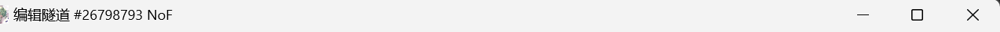

# Linux服务器上搭建Java+Bedrock Minecraft 服务器

声明：本文少部分采用ai辅助生成

### 环境

服务器：Debian 13.2
网络：IPv6 公网，使用 FRP 内网穿透（TCP（java ）+ UDP（基岩）
远程管理：SSH

### 用到的工具

apt update && apt install -y openjdk-21-jre-headless unzip tmux

ssh sakurafrp

本篇全程用ssh进行远程控制

### 关于内网穿透

支持ipv4的公网ip的价格对普通玩家并不友好，因此采用sakura frp 进行内网穿透
为了易用性，推荐在windows客户端创建好隧道再填写配置文件
linux端的frpc.ini配置示例如下：

```ini
[common]
user = <你的登录密钥>

sakura_mode = true
login_fail_exit = false

server_addr = 
server_port = 

[mc_bedrock]

# id = 编辑隧道页面显示的一串数字，示例如附图，只填#后的数字

type = udp 
local_ip = 127.0.0.1
local_port = 19132 (java版为25565)
remote_port = 你的隧道显示的端口
```



### 基岩版服务器

从[中文 Minecraft Wiki](https://zh.minecraft.wiki/)获取liunx版服务端，并用scp指令上传到服务器

解压：unzip "bedrock-server-1.21.94.1.zip"

后台管理：tmux new -s mcserver 创建新窗口，在新窗口内运行服务器核心

运行：./bedrock_server，如果权限不足，使用chmod指令

注:基岩版使用udp协议，本地端口为19132。

### Java 版

上传等部分与基岩版一致。java版服务端一般自带run.sh，运行即可（同样在新窗口内运行）
tmux new -s mc_java
tmux attach -t <name>
运行：./run.sh（脚本内已配置 Java 参数）

为了使非正版玩家可以正常加入，需要在server.properies中将online-mode设定为false

FRP 隧道：TCP 协议，本地端口25565

### 遇到的问题与解决方式

文件名含空格 → 使用双引号或反斜杠转义

路径分隔符错误 → Linux 用 / 而非 \

mv 误将文件重命名 → 目标路径末尾加 / 表示移动到目录

关闭正版验证后皮肤丢失 → 安装 ysm模组替代原版皮肤
